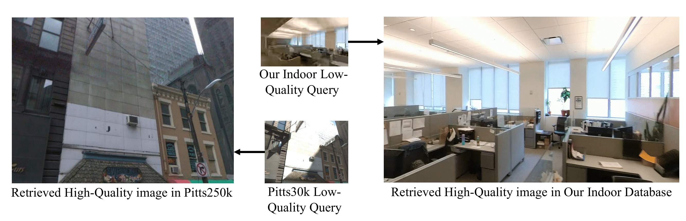
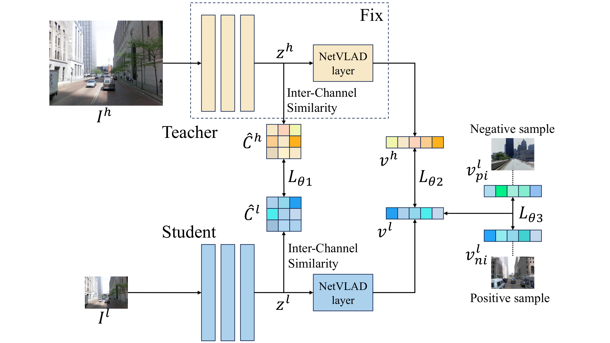
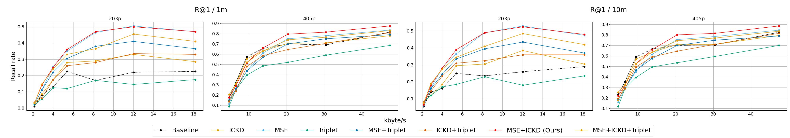
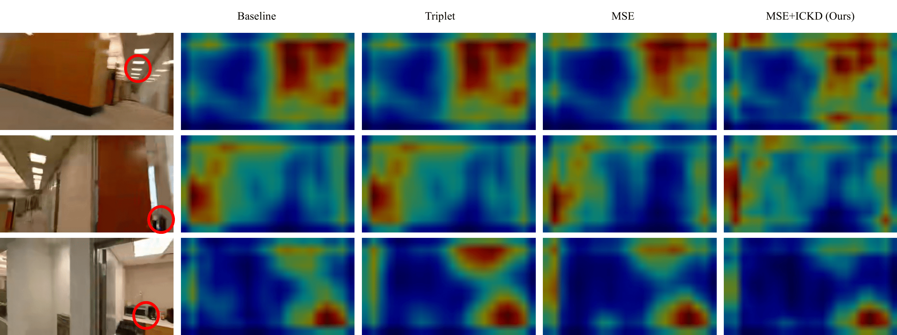

# Distillation Improves Visual Place Recognition for Low-Quality Queries

[Anbang Yang](https://www.linkedin.com/in/anbang-yang/), [Yao Wang](https://engineering.nyu.edu/faculty/yao-wang),[John-Ross Rizzo](https://med.nyu.edu/faculty/johnross-rizzo), [Chen Feng](https://scholar.google.com/citations?user=YeG8ZM0AAAAJ)

<!-- **We significantly improve SPARE3D baselines using self-supervised learning approaches.** -->

 

<!-- Poster Page: https://ai4ce.github.io/Self-Supervised-SPARE3D/ -->

<!-- [**ArXiv: Self-supervised Spatial Reasoning on Multi-View Line Drawings**](https://arxiv.org/abs/2104.13433)      -->

## Abstract
The shift to online computing for real-time visual localization often requires streaming query images/videos to a server for visual place recognition (VPR), where fast video transmission may result in reduced resolution or increased quantization. This compromises the quality of global image descriptors, leading to decreased VPR performance. To improve the low recall rate for low-quality query images, we present a simple yet effective method that uses high-quality queries only during training to distill better feature representations for deep-learning-based VPR, such as NetVLAD. Specifically, we use mean squared error (MSE) loss between the global descriptors of queries with different qualities, and inter-channel correlation knowledge distillation (ICKD) loss over their corresponding intermediate features. We validate our approach using the both Pittsburgh 250k dataset and our own indoor dataset with varying quantization levels. By fine-tuning NetVLAD parameters with our distillation-augmented losses, we achieve notable VPR recall-rate improvements over low-quality queries, as demonstrated in our extensive experimental results. We believe this work not only pushes forward the VPR research but also provides valuable insights for applications needing dependable place recognition under resource-limited conditions.

## Method
Our approach to Visual Place Recognition (VPR) leverages knowledge distillation to make a student network mimic a sophisticated teacher network. Rooted in the NetVLAD algorithm, we employ a dual-branch distillation model comprising a student and teacher branch, both utilizing the VGG-16 architecture. The student branch processes low-quality images, while the teacher works with high-quality images. To assess the student's performance, we introduced three loss functions: Inter-channel Correlation Knowledge Distillation (ICKD) Loss, Mean Squared Error (MSE) Loss, and a Weakly Supervised Triplet Ranking Loss. However, our experiments indicated that a composite loss, excluding the triplet loss, yielded the best results. The final loss function is a weighted sum of ICKD and MSE losses.

 

## Quantity Results
We validated our distillation model using the Pitts250k dataset, a cornerstone in VPR research, and our custom dataset curated from the 6th floor of the Lighthouse Guild. The Pitts250k dataset was segmented for training, database, and validation purposes and underwent downsampling to distinct resolutions. Our dataset emphasizes the effects of video bitrate and resolution, involving extensive video processing, including downsampling and quantization. Post-processing, frames were extracted, and ground truth locations were ascertained using a combination of OpenVSLAM and the Aligner GUI. The following figure shows that our method outperforms the NetVLAD baseline, as well as the other loss configurations on low-quality images' retrieval.

 

## Qualitative Results
To discern why the distillation model trained on Pitts250k with loss setting $4$ (MSE+ICKD) surpasses the performance of other loss configurations, we visualized the attention heatmaps of the feature encoder, as depicted in Figure \ref{fig:heatmap}. We juxtaposed the attention heatmap from loss setting $4$ against those derived from models trained with two other loss settings: $1$ (MSE) and $3$ (Triplet). Observably, under loss setting $4$, the model predominantly concentrates on critical regions while overlooking areas prone to visual aliasing. This focused attention might underpin the superior performance exhibited by this particular loss setting.

 

